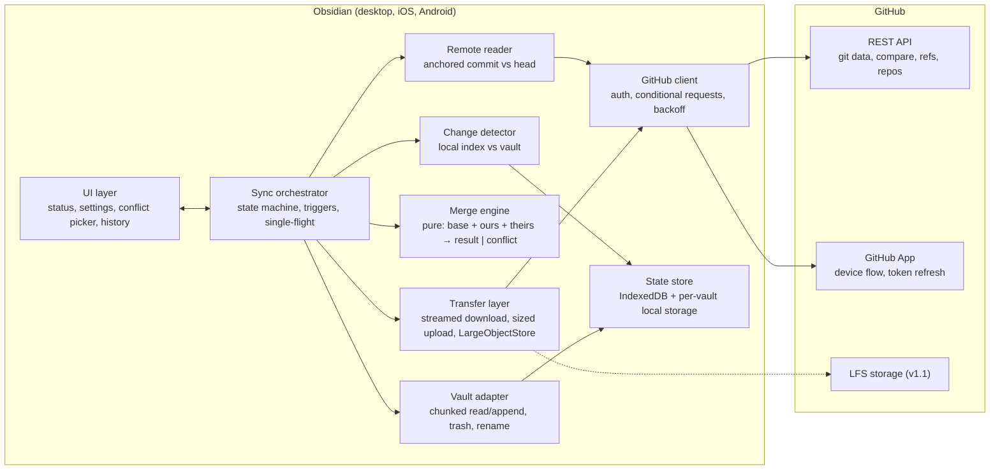

# TRD: Univault

## System Context

Univault is a single Obsidian community plugin. It has no server. Every device runs the same code and talks only to GitHub.

**UI layer.** Status bar item (desktop), status card in settings (all platforms), setup checklist, conflict picker, file history view, sync log. Renders orchestrator state; never runs sync logic. Conflicts arrive as data and can be shown later.

**Sync orchestrator.** Owns the state machine (`idle | syncing | conflicts-pending | offline | error | needs-setup`), the trigger sources (settle timer, visibility, foreground poll, manual), and the single-flight lock. Coalesces triggers that arrive mid-sync into one follow-up run. Runs one sync as: read remote delta → read local delta → classify per path → merge → apply downloads → build and push one commit → advance anchor.

**Change detector.** Compares the vault against the local index using modification time and size, hashing only files whose stat changed. Emits the local delta: added, modified, deleted, renamed (from Obsidian rename events recorded since the last sync).

**Remote reader.** Fetches the branch head with a conditional request. If unchanged, the remote delta is empty at zero quota cost. If changed, fetches the compare between the anchored commit and the head and emits the remote delta. Falls back to a full tree read when the compare is too large or the anchor is missing (first sync, repository or branch change).

**Merge engine.** Pure functions over bytes. Detects text by strict UTF-8 decoding with no NUL bytes, never by extension. Text: line-level three-way merge with a paragraph-aware overlap rule. Binary: any two-sided change is a conflict. Returns either merged bytes or a conflict record. Has no I/O, so it is fully unit-tested.

**Transfer layer.** Downloads stream from the raw blob endpoint through native `fetch` into a temporary file via chunked append, then rename into place. Uploads go through a size policy: under the platform cap they are sent as base64 blobs; over it they are queued as *waiting for desktop*. Exposes a `LargeObjectStore` interface with one v1.0 implementation (Git blobs); LFS is the v1.1 implementation.

**GitHub client.** One wrapper around HTTP: attaches the token, refreshes it when expired, sends `If-None-Match` and caches ETags, maps status codes to typed errors, distinguishes rate limiting from authentication failure, honors `Retry-After`. Uses native `fetch` when the endpoint supports CORS (all of `api.github.com`) and Obsidian's `requestUrl` otherwise.

**State store.** IndexedDB for the sync anchor, the local index, pre-merge snapshots, pending conflicts, the upload queue, rename records, and the sync log. Per-vault Obsidian local storage for the session (refresh token). The plugin settings file holds only preferences.

**Vault adapter.** Thin wrapper over Obsidian's vault and adapter APIs: chunked binary read and append, atomic replace, trash via the file manager, path validation and NFC normalization.

## Stack

- Language/runtime: TypeScript, strict mode, targeting the Obsidian-embedded Chromium and WebViews — the only supported plugin language; strict mode because the sync algorithm's correctness depends on nullability.
- Bundler: esbuild — Obsidian's reference toolchain, single `main.js` output, fast enough for watch mode.
- Tests: Vitest with an in-memory fake of the GitHub Git Data API and a fake vault adapter — the entire sync algorithm must run offline in CI; Vitest is fast, ESM-native, and needs no browser.
- Three-way merge: `node-diff3` for the merge core, `diff` for line and word diffs in the UI — small, pure, no transitive dependencies; the paragraph-overlap rule is written in-house on top.
- HTTP: native `fetch` for `api.github.com` (CORS-enabled, supports streaming bodies), Obsidian `requestUrl` for anything without CORS — streaming is the only way to bound download memory.
- Hashing: WebCrypto SHA-1 for files up to the mobile cap, an incremental SHA-1 for larger files read in chunks — WebCrypto has no streaming API.
- Data store: IndexedDB via a thin typed wrapper (no ORM) — see decision log.
- Auth: GitHub App with device flow and refresh tokens; fine-grained personal access token as fallback — see decision log.
- Hosting: none. One GitHub App registration, named **Univault Sync** (slug `univault-sync`), owned by the `univault-app` organization. The codebase stays at `github.com/trannttoan/univault`. No telemetry endpoint.
- Minimum Obsidian version: the release that shipped ranged `readBinary` (July 2026; exact number to confirm in spike S6). `appendBinary` arrived in 1.12.3.

## Core Data Model

Device-local (IndexedDB unless noted):

- **SyncAnchor** — repository (`owner/repo`), branch, last synced commit SHA, its tree SHA. One per vault. Discarded when repository or branch changes.
- **IndexEntry** — path, mtime, size, blob SHA, mode. One per synced file. Represents the state both sides agreed on at the anchor.
- **RenameRecord** — old path, new path, observed at. Accumulated between syncs from Obsidian rename events; consumed when the next commit is built and recorded as a commit trailer.
- **PendingConflict** — path, kind (`text-overlap | binary | delete-vs-modify`), base SHA, remote SHA, remote device and time, local snapshot id. Survives restarts; drives the conflict picker.
- **Snapshot** — id, path, bytes, created at, reason (`pre-merge | conflict-local`). Retained 30 days. Surfaced in file history as "this device's version".
- **UploadQueueItem** — path, size, reason (`over-mobile-cap`). Drained by the next desktop sync.
- **SyncLogEntry** — started at, duration, trigger, counts, error code. Ring buffer of the last 200.
- **Session** (per-vault local storage) — host, login, access token, refresh token, expiry, auth kind (`app | pat`).
- **Preferences** (plugin settings file) — settle period, triggers on/off, mobile upload cap, config categories, device name.

In the repository:

- **Branch content** — the vault, as plain files. Nothing else in the tree except `.univault-ignore` at the root.
- **DeviceManifest** — under `refs/univault/devices/<login>/<device-id>`, a one-file tree: device name, platform, plugin version, last sync time, last synced commit. Never on the branch.
- **Commit trailers** — `Univault-Device: <login>/<device-name>`, `Univault-Merge: <path> <base> <ours> <theirs>` per auto-merged file, `Univault-Rename: <old> -> <new>` per rename. The history view reads these; nothing is stored elsewhere.

Relationships: SyncAnchor is the parent of every IndexEntry. A PendingConflict references one IndexEntry (by path) and one Snapshot. RenameRecords are consumed into the next commit's trailers and then deleted.

## Interface Contracts

**GitHub.** REST only. Git Data endpoints (blobs, trees, commits, refs) for reads and writes; compare for remote deltas; the raw blob media type for streaming downloads; repository and installation endpoints during setup; device-flow and token endpoints on the GitHub App. All writes are conditional: the ref update names the expected parent, and a rejection means "pull and retry," never "force."

**Orchestrator ↔ detectors.** Both detectors return a delta value (`Map<path, Change>`) and never mutate anything. Classification per path is a pure function of `(localChange, remoteChange)` with exactly these outcomes: `noop | download | upload | delete-local | delete-remote | merge | conflict`.

**Orchestrator ↔ merge engine.** `merge(base, ours, theirs, path) → { kind: "merged", bytes } | { kind: "conflict", detail }`. Synchronous, pure, no I/O.

**Orchestrator ↔ transfer.** `download(sha, path)` streams to disk and resolves when the file is in place. `upload(path) → sha | queued`. `LargeObjectStore` is the seam LFS implements in v1.1: `put(path, bytes|stream) → ref`, `get(ref) → stream`.

**Orchestrator ↔ UI.** One-directional events: `state(changed)`, `progress(n, total, phase)`, `conflicts(list)`, `result(summary)`. The UI sends commands: `sync(reason)`, `resolve(path, choice)`, `restore(path, versionRef)`. The UI never awaits the engine inside a modal.

**Sync vs async.** One sync at a time per vault, always asynchronous, cancellable at phase boundaries. Triggers arriving during a run set a "run again" flag rather than queueing.

## Cross-Cutting Rules

- **Auth propagation.** Tokens are handled only by the session module (device flow, refresh, PAT entry) and the GitHub client; no other module receives one. It refreshes on 401 once, then surfaces `auth-expired`. Tokens never appear in logs, errors, URLs, or the sync log; the client redacts any header value before an error is constructed.
- **Errors.** One `UnivaultError` type with a closed `code` set (`offline | rate-limited | auth-expired | forbidden | not-found | conflict-retry | tree-too-large | path-unsafe | storage-full | unknown`) and an optional cause. Modules throw codes; only the UI maps codes to strings. Nothing matches on message text.
- **Rate limits.** 403 or 429 with rate-limit headers is `rate-limited`, never `auth-expired`. The orchestrator pauses automatic syncs until the reset time and shows it.
- **Retries.** Idempotent reads retry three times with exponential backoff starting at one second. Writes are not retried blindly; a rejected ref update triggers one re-sync cycle, at most three per trigger.
- **Conditional requests.** Every GET stores its ETag and sends `If-None-Match`. The foreground poll relies on 304 being free.
- **Memory.** A byte budget bounds transient bytes in flight (16 MB on mobile, 256 MB on desktop). A small scheduler admits work by declared size, so many small transfers run concurrently while a large one runs alone. Large payloads leave the heap through streams or Blob-backed bodies; a code path that can only take a heap buffer (the Git blob upload endpoint) is subject to the platform cap. Downloads stream. Hashing of large files is incremental. The remote tree, when a full read is unavoidable, is parsed once and discarded.
- **Paths.** Every path from the repository is canonicalized (backslashes to slashes, collapse duplicate slashes, NFC) and rejected if it contains `.` or `..` segments, is absolute, begins with the config directory in any letter case, or targets the plugin's own folder. Every path from the vault is NFC-normalized before comparison.
- **Text vs binary.** Decided by content (strict UTF-8, no NUL). A known binary extension may short-circuit to binary to avoid sniffing large media; nothing is ever classified as text by extension. Bytes are stored exactly as read; no line-ending normalization. The merge engine treats `\r\n` and `\n` as line terminators.
- **Atomic writes.** Downloads land in a temporary file beside the target and are renamed into place. A crash mid-download never leaves a truncated note.
- **Deletions.** Always through Obsidian's file manager so the user's *Deleted files* preference applies.
- **Logging.** A ring buffer in IndexedDB, not the console, with a "copy log" action. Console output only in a debug preference. Every entry redacts tokens and truncates paths to the vault-relative form.
- **Config.** Preferences in the plugin settings file, per-device state in IndexedDB with a schema version and forward-only migrations. The plugin refuses to run against a newer schema than it knows.
- **Concurrency.** One sync at a time per vault, enforced by the orchestrator, not by callers. Within a sync, transfers and hashing run concurrently under the byte budget.
- **Time.** All timestamps UTC ISO 8601. Device names are user-facing; device ids are UUIDs generated on install.

## Non-Functional Requirements

- **Scale (provisional, spike S1 confirms):** excellent to 10,000 files and 1 GB, working to 50,000 files and 5 GB, refused beyond the recursive tree limit (100,000 entries or 7 MB).
- **Incremental sync cost:** a one-note change on a 10,000-file vault completes in under five seconds on a low-end Android phone, and an unchanged remote costs zero quota.
- **Propagation:** a change on one device is visible on another foregrounded device within 30 seconds on Wi-Fi.
- **Memory:** transient bytes in flight never exceed the byte budget (16 MB on mobile, 256 MB on desktop). Downloads cost one chunk each regardless of file size. A Git blob upload costs about 1.4 times the file and therefore runs alone and is capped at 20 MB on mobile and 100 MB on desktop.
- **Offline:** every automatic trigger checks connectivity first and exits silently when offline. Manual sync while offline reports `offline` once. Conflicts and queued uploads persist across restarts and offline periods.
- **Quota:** a steady-state heavy user (one sync every 15 seconds of pausing, ten changed files each) stays under 500 requests per hour.
- **Durability:** the anchor and index advance only after the ref update succeeds. A crash at any phase boundary leaves the vault and the index in a state the next sync resolves without loss.

## Decision Log

ADRs live in `docs/adr/`.

- ADR-001 Sync state model: **commit-anchored with local index** over a path-to-SHA baseline map (rejected: full tree read every sync, grows with vault) and a local shadow copy (rejected: doubles disk use on phones).
- ADR-002 Commit topology: **single branch, optimistic conditional commits** over per-device branches with server-side merge (rejected: branch clutter, unauthored merge commits, no control over text merge) and an event-log repository (rejected: repo is no longer a plain copy of the vault).
- ADR-003 Merge engine: **line-level three-way merge with paragraph-aware overlap** over word-level merge (rejected: more broken results, harder to explain) and plain diff3 (rejected: silently merges two rewrites of one paragraph). Conflict losers are **sibling files with device and time suffix** over a conflicts folder (rejected: breaks the note-to-copy link) and history-only (rejected: no visible cue).
- ADR-004 Local persistence: **IndexedDB for state, per-vault local storage for the session** over the plugin settings file (rejected: rewritten every sync, inside the vault folder) and hidden vault files (rejected: inside the vault, must be excluded everywhere).
- ADR-005 Repository metadata: **hidden refs for devices, one root ignore file, commit trailers for annotations** over a `.univault/` folder (rejected: manifests create commits) and Git-only conventions (rejected: no home for device state or annotations).
- ADR-006 Authentication: **GitHub App with device flow, PAT fallback** over a classic OAuth app (rejected: `repo` scope grants every private repository) and PAT only (rejected: worst onboarding, top competitor failure).
- ADR-007 Large files: **Git Data blobs with a 20 MB mobile cap in v1.0, LFS in v1.1** over LFS in v1.0 (rejected: too much surface for the first release) and a hard 25 MB cap everywhere (rejected: excludes files users expect to sync).

## Deferred Decisions

- **LFS size threshold and whether the mobile cap can be removed.** Decide when spike S3 reports whether Blob-bodied uploads stream in both WebViews and whether LFS storage sends CORS headers.
- **Bulk first-sync download via repository tarball.** Decide when spike S4 reports whether `codeload.github.com` sends CORS headers for authenticated requests. If not, first sync stays per-blob.
- **Inline text batching in tree requests.** Decide when spike S1 shows first sync of 10,000 files exceeding 30 minutes, and spike S5 reports the accepted tree body size.
- **Non-recursive tree fallback above 50,000 files.** Decide when real users hit tree truncation; until then the plugin refuses with a message.
- **Word-level merge as an option.** Decide when conflict telemetry from the sync log (local only, user-shared) shows same-paragraph overlaps are a large share of prompts.
- **Token expiry.** Ship with expiring user tokens and refresh. Revisit if refresh failures are a top support issue after release.
- **Conflict-copy cleanup tooling.** Decide when users report clutter; the history view already lets them delete copies.
- **Foreground poll interval.** Ship at 30 seconds. Revisit if the quota measurement in S1 shows conditional requests are not free in practice.

## Risks & Spikes

- **S1 Scale envelope.** Synthetic vaults at 1k to 50k files; measure tree bytes and parse heap on Android, local scan time cold and warm, first-sync request count and wall time, incremental sync time. Replaces the provisional scale targets.
- **S2 Repository creation under a GitHub App.** Verify whether a user-to-server token can create a user repository and how a new repository joins an installation limited to selected repositories. Fallback: send the user to github.com to create it, then refresh the picker.
- **S3 Streaming uploads.** Test `fetch` with a Blob body obtained from the vault's resource URL, and with `duplex: "half"` streams, in Electron, Android WebView, and iOS WKWebView. Test whether the LFS storage endpoint sends CORS headers. Decides the mobile cap's future.
- **S4 Tarball CORS.** Authenticated archive download through `codeload.github.com` with a streaming body and incremental gunzip and untar. Decides the bulk first-sync path.
- **S5 Tree inline content limits.** Find the maximum accepted `POST /git/trees` body with inline `content` entries and the failure mode past it.
- **S6 Minimum Obsidian version.** Confirm the exact release carrying ranged `readBinary`, and that `appendBinary` behaves on iOS.
- **S7 Free conditional polling.** Confirm that a 304 on the branch ref endpoint does not decrement `x-ratelimit-remaining` for user-to-server tokens.
- **S8 Paragraph-overlap heuristic.** Build a corpus of realistic same-note edits and measure false conflicts versus silent bad merges for candidate rules (same paragraph, within N lines).
- **S9 IndexedDB persistence on iOS.** Confirm WKWebView does not evict IndexedDB for an app-embedded WebView, and measure quota on a low-storage device. Fallback: mirror the anchor and index to the plugin folder as a recovery copy.
